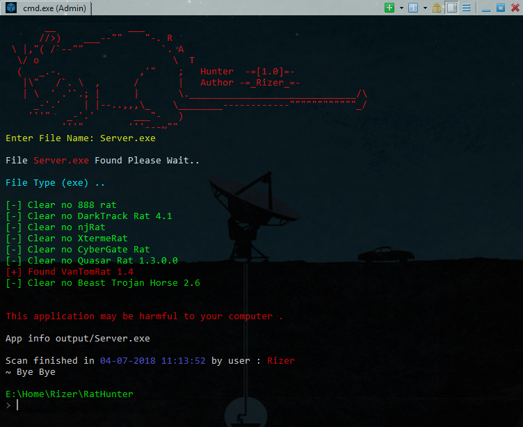
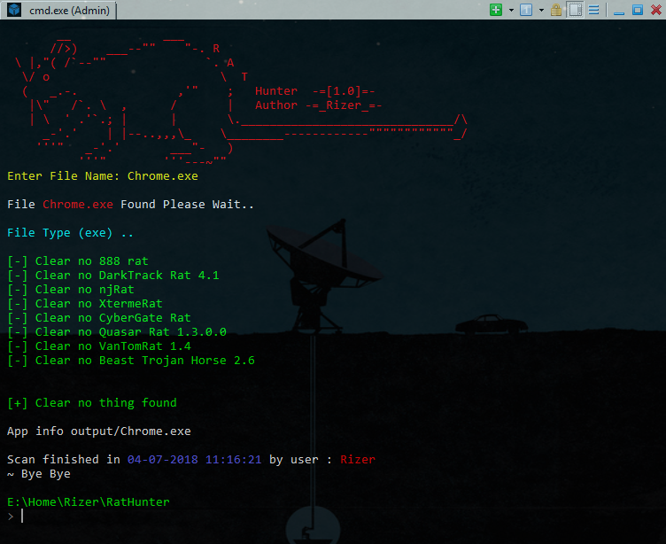
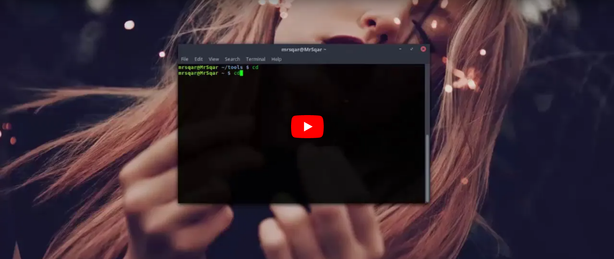

# Rat Hunter v1.0
Rat hunter is project to detect Trojans , 
this project now supports 10 different trojans 
and i'm working to add more & i will add option to scan obfuscated Trojans , 
if you want me add new Trojan send it to <a href="mailto:k4hawk@gmail.com">k4hawk@gmail.com</a>   
i've made this project for two reasons so you can use it to scan suspected files 
or you can read the source code to learn how it been made. 
# Operation System
<b>[+] linux</b> 
<b>[~] Windows [soon]</b>
# Trojans Supports
Windows Trojans
<ul>
<li>888 Private Rat</li>
<li>DarkTrack</li>
<li>NjRat</li>
<li>XtermeRat</li>
<li>CyberGate</li>
<li>Quasar Rat</li>
<li>VanTomRat</li>
<li>Beast Trojan Horse</li>
</ul>
Android Trojans
<ul>
<li>SpyNote 5.0</li>
<li>DroidJack</li>
</ul>
<h1>ScreenShots</h1>

 

<h1>Video</h1>

 
<h1>License</h1>

    DO WHAT THE FUCK YOU WANT TO PUBLIC LICENSE
    TERMS AND CONDITIONS FOR COPYING, DISTRIBUTION AND MODIFICATION
    You just DO WHAT THE FUCK YOU WANT TO.
